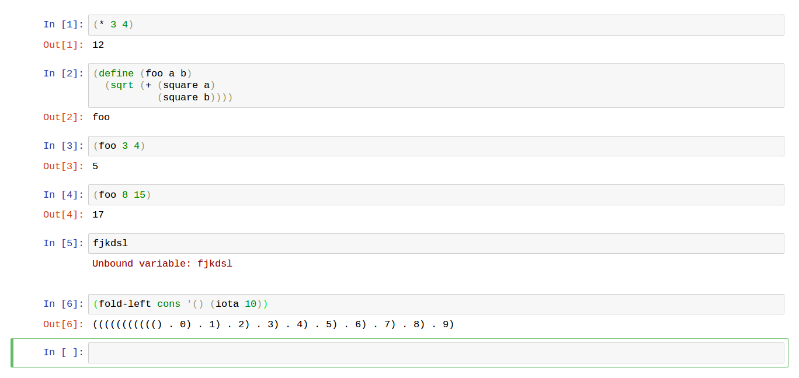

# mit-scheme-kernel
Jupyter Kernel for MIT Scheme



## Installation

### Docker
```
docker run -it kkwok/jupyter-mit-scheme
```

### Source
For Debian / Ubuntu. It's probably possible to make it work on macOS but I haven't tried.

First get MIT Scheme 9.2+
```
$ wget http://ftp.gnu.org/gnu/mit-scheme/stable.pkg/9.2/mit-scheme-9.2-x86-64.tar.gz
$ tar xvf mit-scheme-9.2-x86-64.tar.gz
$ cd mit-scheme-9.2/src/
$ ./configure
$ make compile-microcode
$ sudo make install
```
Then get ZeroMQ 4.2.1+
```
$ wget https://github.com/zeromq/libzmq/releases/download/v4.2.1/zeromq-4.2.1.tar.gz
$ tar xvf zeromq-4.2.1.tar.gz
$ cd zeromq-4.2.1/
$ ./configure
$ make
$ sudo make install
```
And finally 
```
$ git clone https://github.com/joeltg/mit-scheme-kernel
$ cd mit-scheme-kernel
$ export LD_LIBRARY_PATH=/usr/local/lib
$ make
$ sudo make install
$ jupyter console --kernel mit-scheme
Jupyter console 5.1.0

MIT Scheme Kernel


In [1]: (fold-left cons '() (iota 4))
Out[1]: ((((() . 0) . 1) . 2) . 3)
```
